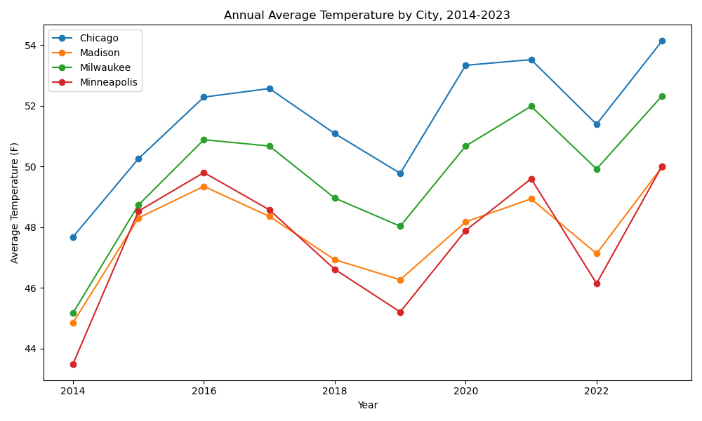
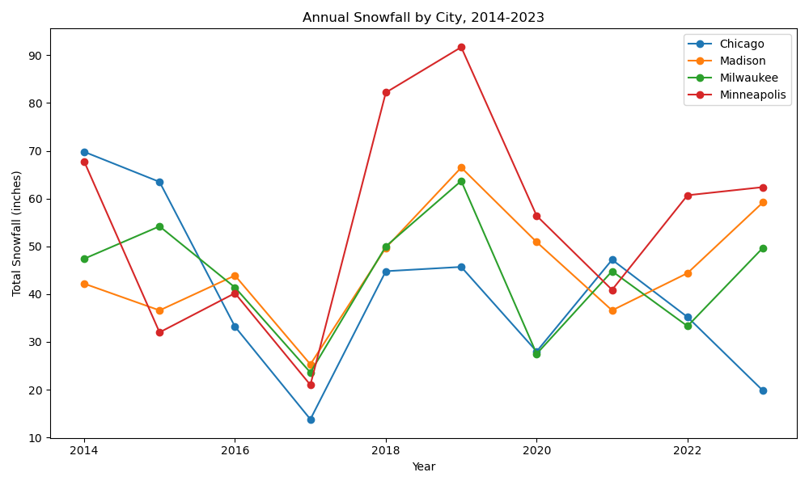
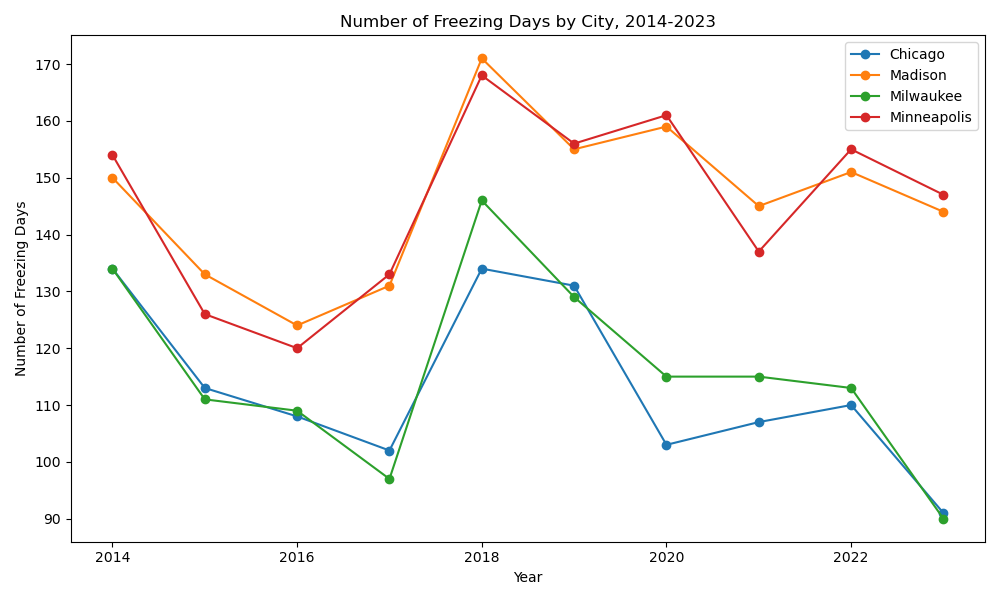

# Are Winters Becoming Warmer in Selected Upper Midwest Cities?

Yu Zhang  
AAE 718  
Project 03: Climate Data  

GitHub repository: [Climate Data Project](GITHUB_REPO_LINK)

## Introduction

Climate patterns can vary a lot from year to year, especially in the Upper Midwest. Winters in this region are often cold and snowy, but recent years may feel warmer or less consistent.

In this project, I use daily climate data to study weather patterns in four Upper Midwest cities from 2014 to 2023. My main research question is:

**Are winters and annual weather patterns changing in selected Upper Midwest cities from 2014 to 2023?**

I focus on Chicago, Madison, Milwaukee, and Minneapolis. These cities are close enough to compare, but they also have different local climates.

## Data

The data come from NOAA Daily Summaries. I use data from four airport weather stations:

- Chicago O'Hare International Airport, Illinois
- Madison Dane County Regional Airport, Wisconsin
- Milwaukee Mitchell Airport, Wisconsin
- Minneapolis St. Paul International Airport, Minnesota

The final analysis uses the ten complete years from 2014 to 2023. The downloaded file also included January 1, 2024, but I removed 2024 because it was not a complete year.

The cleaned dataset has 14,608 rows and 15 columns. Each city has 10 years of daily data. The main variables used in this project are:

- `TMAX`: daily maximum temperature
- `TMIN`: daily minimum temperature
- `SNOW`: daily snowfall
- `SNWD`: daily snow depth

The `TAVG` variable was missing for all observations. Because of this, I calculated daily average temperature using:

`daily_avg_temp = (TMAX + TMIN) / 2`

## Methods

I used Python and pandas to clean and analyze the data. First, I converted the date column to a datetime format. Then I created year and month variables and simplified the station names into city names.

I created three annual measures:

1. Annual average temperature
2. Annual total snowfall
3. Number of freezing days

A freezing day is defined as a day when the minimum temperature is at or below 32°F. These measures help compare general temperature patterns and winter conditions across the four cities.

## Results

### Annual Average Temperature

The annual average temperature graph shows that all four cities had year-to-year changes. Chicago was usually the warmest city, while Madison and Minneapolis were colder. The year 2023 was relatively warm for all four cities. This suggests that recent conditions were warmer, but the pattern is not a steady increase every year.

### Annual Snowfall

The snowfall graph shows that annual snowfall changed a lot from year to year. Minneapolis often had higher snowfall than the other cities, especially in 2018 and 2019. Chicago had high snowfall in 2014 and 2015 but lower snowfall in some later years. Overall, snowfall is more variable than temperature, so it is harder to identify a clear long-term trend from only ten years of data.

### Freezing Days

The freezing days graph shows the number of days when the minimum temperature was at or below 32°F. Madison and Minneapolis usually had more freezing days than Chicago and Milwaukee. Chicago and Milwaukee had fewer freezing days in 2023 than in many earlier years. However, freezing days also changed a lot from year to year.

## Discussion

The results suggest that the four cities experienced some warmer recent conditions, especially in 2023. The temperature graph shows that annual average temperature was higher in 2023 for all four cities. The freezing days graph also suggests that some cities had fewer cold days by the end of the period.

Snowfall is less clear. Some years had much more snow than others, and snowfall can be strongly affected by individual storms. Because of this, annual snowfall does not show a simple increasing or decreasing pattern.

One limitation of this project is that it only uses ten years of data. This is enough for the project requirement, but it is not long enough to make a strong claim about long-term climate change. A longer period, such as 30 years, would give a stronger analysis. Another limitation is that average temperature was calculated from maximum and minimum temperature because `TAVG` was missing.

## Conclusion

Overall, the data show that selected Upper Midwest cities had noticeable changes in temperature, snowfall, and freezing days from 2014 to 2023. The clearest pattern is that 2023 was relatively warm across all four cities. However, the data also show strong year-to-year variation, especially in snowfall. This project shows how daily climate data can be used to compare cities and study changes in winter conditions over time.